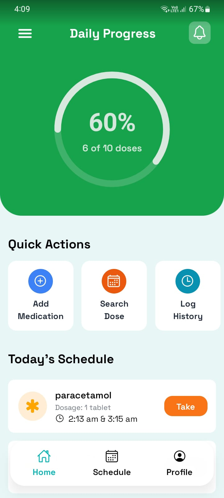
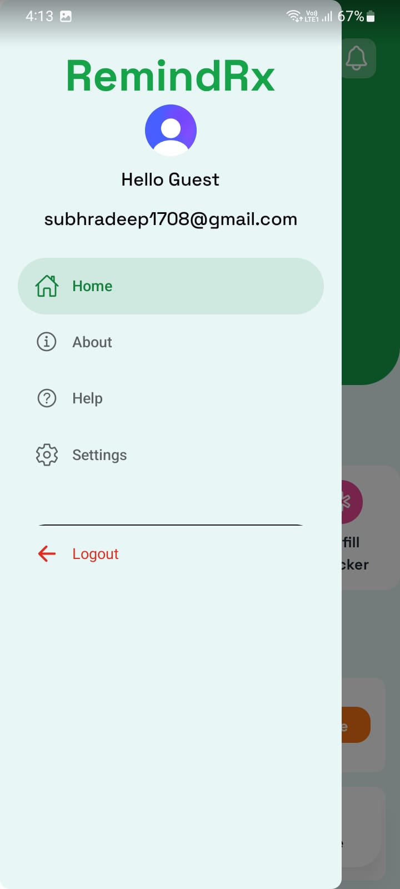
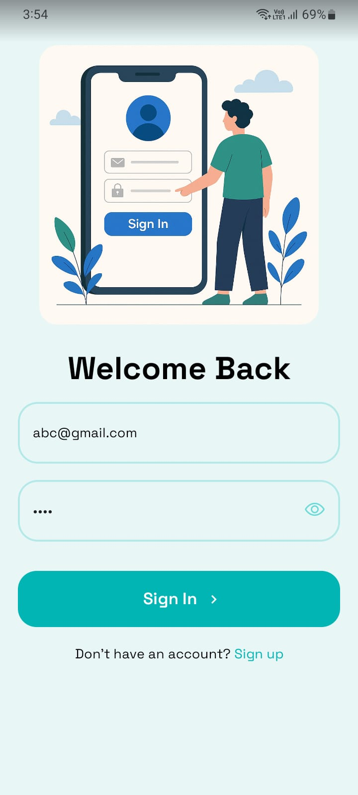
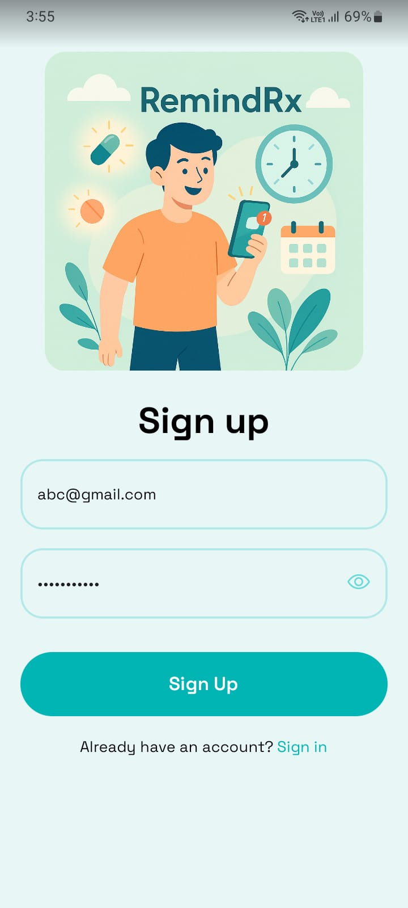
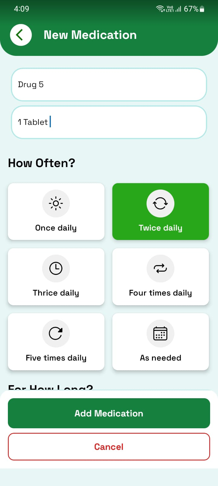
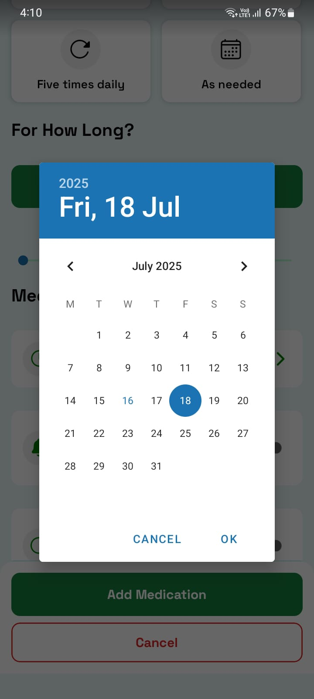
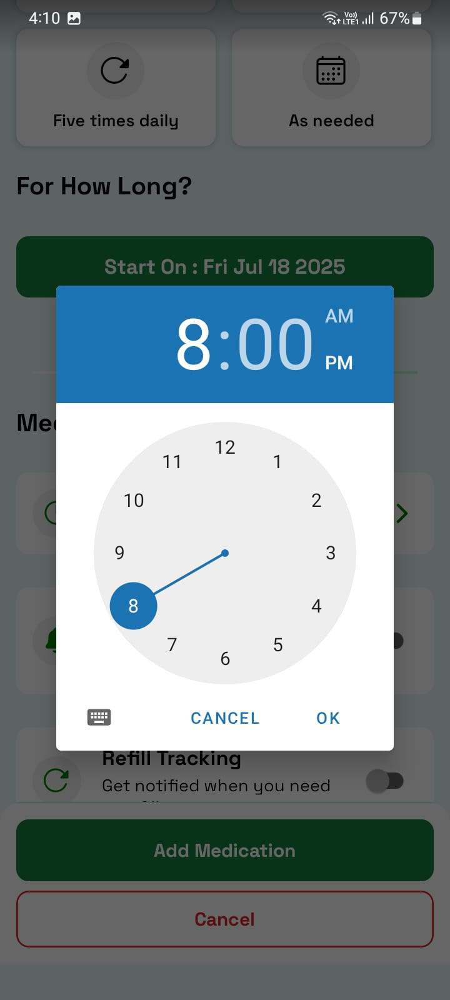
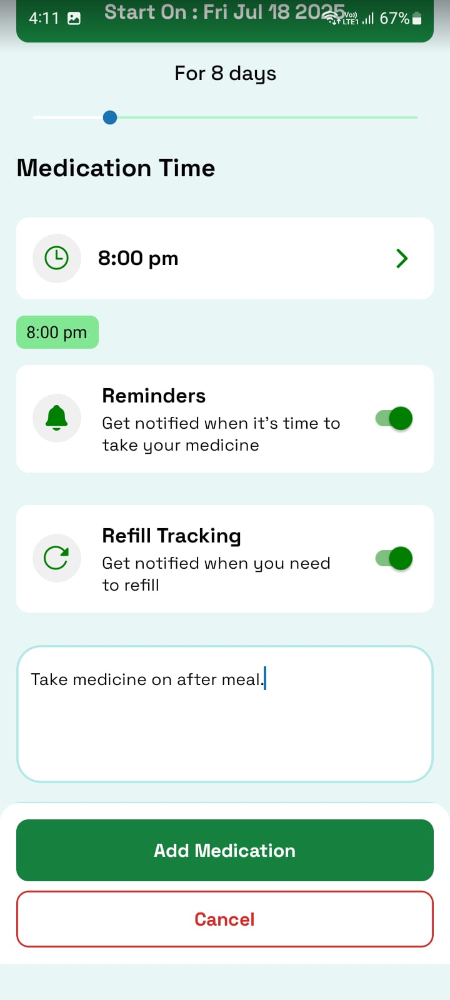
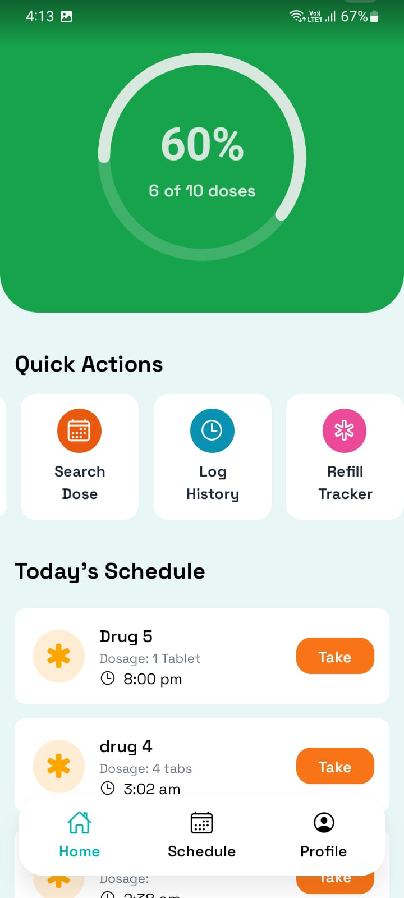
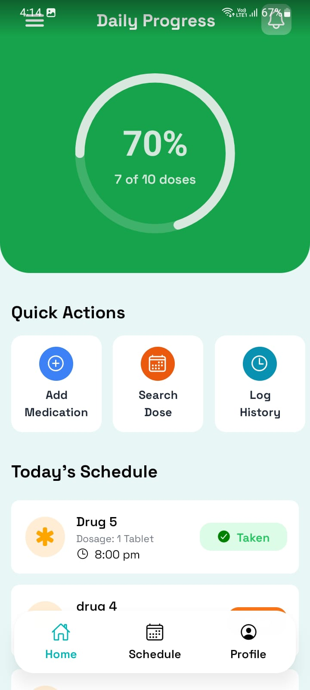

<h1 align="center">💊 RemindRx: A Medicine Reminder App</h1> 


<a href="https://github.com/Subhradeep1708/Medicine-Reminder-App/blob/main/LICENSE"></a>

<a href="https://github.com/Subhradeep1708/Medicine-Reminder-App"></a>
 


<p align="center"><em>A sleek and simple React Native app to help you stay on top of your medications and refills.</em></p> 


<h2>📖 Table of Contents</h2> 

- <a href="#overview"> Overview </a>
- <a href="#project-insights"> Project Insights </a>
- <a href="#features">Features</a>
- <a href="#screenshots">Screenshots</a>
- <a href="#installation">Installation</a>
- <a href="#contributing">Contributing</a>
- <a href="#acknowledgments">Acknowledgments</a>
- <a href="#contact">Contact</a>
- <a href="#how-to-contribute">How to Contribute</a>
- <a href="#code-of-conduct">Code of Conduct</a>
- <a href="#contribution-guidelines">Contribution Guidelines</a>
- <a href="#suggestions-feedback"> Suggestions & Feedback</a>
- <a href="#show-your-support">Show Your Support</a>
- <a href="#license">License</a>
- <a href="#stargazers">Stargazers</a>
- <a href="#forkers">Forkers</a>
- <a href="#project-admin">Project Admin</a>
- <a href="#how-to-contribute">How to Contribute</a>


<h2 id="overview">🔍 Overview</h2>

> RemindRx is a medicine tracker and reminder app built using <strong>React Native</strong> and <strong>Expo</strong>. It offers a minimal UI, customizable dosage plans, time-based notifications, and refill tracking — all to ensure you never miss a dose.


<div align="center">
  
</div>


<h2 id="project-insights">📊 Project Insights</h2>

<table align="center">
    <thead align="center">
        <tr>
            <td><b>🌟 Stars</b></td>
            <td><b>🍴 Forks</b></td>
            <td><b>🐛 Issues</b></td>
            <td><b>🔔 Open PRs</b></td>
            <td><b>🔕 Closed PRs</b></td>
            <td><b>🛠️ Languages</b></td>
            <td><b>👥 Contributors</b></td>
        </tr>
     </thead>
    <tbody>
         <tr>
            <td></td>
            <td></td>
            <td></td>
            <td></td>
            <td></td>
            <td></td>
            <td></td>
        </tr>
    </tbody>
</table>


🌟 **Exciting News...**

🚀 This project is now an official part of GirlScript Summer of Code – GSSoC'25! 💃🎉💻 We're thrilled to welcome contributors from all over India and beyond to collaborate, build, and grow *Medicine-Reminder-App!* Let’s make learning and career development smarter – together! 🌟👨‍💻👩‍💻

👩‍💻 GSSoC is one of India’s **largest 3-month-long open-source programs** that encourages developers of all levels to contribute to real-world projects 🌍 while learning, collaborating, and growing together. 🌱

🌈 With **mentorship, community support**, and **collaborative coding**, it's the perfect platform for developers to:

- ✨ Improve their skills
- 🤝 Contribute to impactful projects
- 🏆 Get recognized for their work
- 📜 Receive certificates and swag!

🎉 **I can’t wait to welcome new contributors** from GSSoC 2025 to this Medicine-Reminder-App project family! Let's build, learn, and grow together — one commit at a time. 🔥👨‍💻👩‍💻


<h2 id="features">✨ Features</h2>

- 📱 Built with React Native and optimized for Android (iOS support coming soon).
- ⏰ Real time noficitaion & add multiple medication times with 12-hour format display.
- 🧪 Set dosage and duration with slider control.
- 📝 Add custom notes or special instructions.
- 🔔 Enable/disable reminders and refill tracking with toggle switches.
- 📆 Date & time picker with native UI integration.
- 🧭 Clean, modern interface with intuitive layout and fixed action buttons.


<h2 id="screenshots">📸 Screenshots</h2>

<h4>Home Screen</h4>
<table>
  <tr>
    <td></td>
    <td></td>
  </tr>
</table>

<h4>Authentication Screen</h4>
<table>
  <tr>
    <td></td>
    <td></td>
    <td></td>
  </tr>
</table>
<h4>Add Medication Screen</h4>
<table>
  <tr>
    <td></td>
    <td></td>
    <td></td>
    <td></td>
  </tr>
</table>

<h4>Newly Added Medicine</h4>


<h4>Medicine Taken</h4>


<h4>Schedule Screen</h4>


<h2 id="installation">⚙ Installation</h2>

***Clone the repository***

```bash
git clone https://github.com/Subhradeep1708/Medicine-Reminder-App
cd Medicine-Reminder-App
```

***Install dependencies***

```bash
npm install
```

***Start the app***

```bash
npx expo start
```


<h3 id="contributing">👥 Contributing</h3>

We welcome contributions from everyone, especially participants of **GSSoC’25**! 

Follow these steps to contribute:
- Fork the repository.
- Create a new branch: `git checkout -b feature-name`.
- Make your changes and commit: `git commit -m "Added new feature"`.
- Push to your fork: `git push origin feature-name`.
- Create a Pull Request.


<h2 id="acknowledgments">🙏 Acknowledgments</h2>

- React Native & Expo
- React Native DateTimePicker
- Ionicons, Slider, and Paper UI for styling & components
- Thanks to all contributors of this project 
- Special shoutout to **GirlScript Summer of Code (GSSoC’25)** for the amazing community and support!
- Built with dedication, collaboration, and lots of chai 


<h2 id="contact">📞 Contact</h2> <p> Project Maintainer: <a href="mailto:subhradeep1708@gmail.com">subhradeep1708@gmail.com</a><br> GitHub: <a href="https://github.com/Subhradeep1708">@Subhradeep1708</a> </p> 


<h2 id="how-to-contribute">🤝How to Contribute</h2>

We love contributions from the community! Whether it's a bug report, a new feature, or a documentation improvement, we appreciate your help.

***How to Contribute***

1.  **Fork the repository** and create a new branch for your changes.
2.  **Make your changes** and ensure everything is working as expected.
3.  **Submit a pull request** with a clear description of your changes.

***Found a Bug?***

-   Check the [issue tracker](https://github.com/Subhradeep1708/Medicine-Reminder-App/issues) to see if the bug has already been reported.
-   If not, open a new issue and provide as much detail as possible.

***Have a Feature Idea?***

-   We'd love to hear it! Open an issue to discuss your idea.


<h2 id="code-of-conduct">📜 Code of Conduct</h2>

Please refer to the [`Code of Conduct`](https://github.com/Subhradeep1708/Medicine-Reminder-App/blob/main/CODE_OF_CONDUCT.md) for details on contributing guidelines and community standards.


<h2 id="contribution-guidelines">🤝👤 Contribution Guidelines</h2>

We love our contributors! If you'd like to help, please check out our [`CONTRIBUTE.md`](https://github.com/Subhradeep1708/Medicine-Reminder-App/blob/main/CONTRIBUTING.md) file for guidelines.

>Thank you once again to all our contributors who has contributed to **Medicine-Reminder-App!** Your efforts are truly appreciated. 💖👏

<!-- Contributors badge (auto-updating) -->

[](https://github.com/Subhradeep1708/Medicine-Reminder-App/graphs/contributors)

<!-- Contributors avatars (auto-updating) -->
<p align="left">
  <a href="https://github.com/Subhradeep1708/Medicine-Reminder-App/graphs/contributors">
    
  </a>
</p>

See the full list of contributors and their contributions on the [`GitHub Contributors Graph`](https://github.com/Subhradeep1708/Medicine-Reminder-App/graphs/contributors).


<h2 align="center">
<p style="font-family:var(--ff-philosopher);font-size:3rem;"><b> Show some  by starring this awesome repository!
</p>
</h2>


<h2 id="suggestions-feedback">💡 Suggestions & Feedback</h2>

Feel free to open issues or discussions if you have any feedback, feature suggestions, or want to collaborate!


<h2 id="show-your-support">⭐️🙌 Show Your Support</h2>

*If you find Medicine-Reminder-App project helpful, give it a star! ⭐ to support more such educational initiatives:*

- Giving the repo a ⭐ on GitHub
- Sharing it with your developer friends
- Contributing to the project


<h2 id="license">📄 License</h2>

This project is licensed under the MIT License - see the [`License`](https://github.com/Subhradeep1708/Medicine-Reminder-App/blob/main/LICENSE) file for details.


<h2 id="stargazers">⭐ Stargazers</h2>

<div align="center">
  <a href="https://github.com/Subhradeep1708/Medicine-Reminder-App/stargazers">
    
  </a>
</div>


<h2 id="forkers">🍴 Forkers</h2>

<div align="center">
  <a href="https://github.com/Subhradeep1708/Medicine-Reminder-App/members">
    
  </a>
</div>


<h2 id="project-admin" align="center">🧑‍💻Project Admin:</h2>
<table>
<tr>
<td align="center">
<a href="https://github.com/Subhradeep1708"></a><br><sub><b>Subhradeep Sardar</b><br><a href="https://www.linkedin.com/in/subhradeep-sardar/"></a></sub>
</td>
</tr>
</table>


<h1 align="center"> Give us a Star and let's make magic! </h1>

<p align="center">
     
</p>


<h3 align="center"> 👨‍💻 Built with ❤️ by Medicine-Reminder-App Team</h3>
<h4 align="center"> ❤️ Subhradeep Sardar and Contributors ❤️ </h4>
<p align="center">
  <a href="https://github.com/Subhradeep1708/Medicine-Reminder-App/issues">Open an Issue</a> | <a href="https://github.com/Subhradeep1708/Medicine-Reminder-App/issues">Report Bug</a>
</p>


<p align="center">
  <a href="#top" style="font-size: 18px; padding: 8px 16px; display: inline-block; border: 1px solid #ccc; border-radius: 6px; text-decoration: none;">
    ⬆️ Back to Top
  </a>
</p>


> Ready to show off your coding achievements? Get started with **Medicine-Reminder-App** today! 🚀
